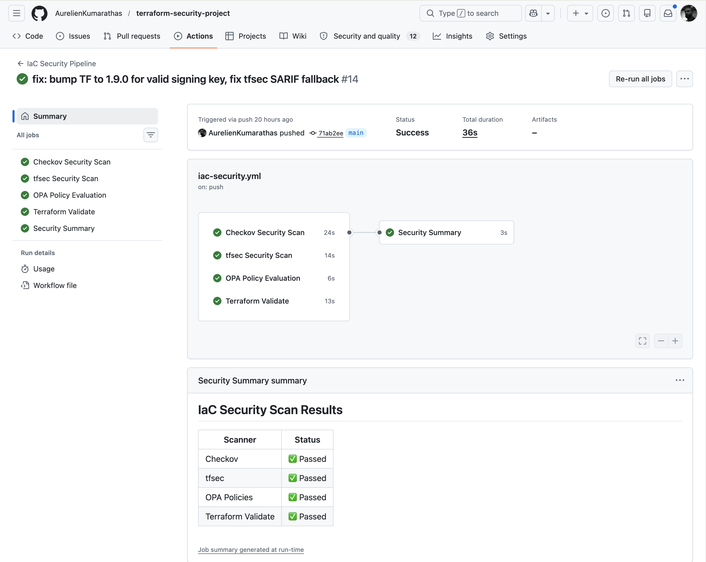

# Terraform IaC Security Pipeline — QuantumTrade

[](https://github.com/AurelienKumarathas/terraform-security-project/actions/workflows/iac-security.yml)


## Overview

This project demonstrates an enterprise-grade Infrastructure as Code (IaC) security pipeline for **QuantumTrade**, a fintech platform processing cryptocurrency transactions. It implements a defence-in-depth scanning approach using three independent tools — Checkov, tfsec, and OPA — to identify and block security misconfigurations before they ever reach AWS.

The pipeline runs automatically on every push and pull request via GitHub Actions. Findings are uploaded to the GitHub Security tab as SARIF so they're visible at the PR level, not buried in logs.

> **Branch strategy:**
> - [`test-security-scan`](https://github.com/AurelienKumarathas/terraform-security-project/tree/test-security-scan) — the intentionally vulnerable baseline. Run the tools here to reproduce every finding.
> - [`main`](https://github.com/AurelienKumarathas/terraform-security-project/tree/main) — the fully remediated, hardened state. This is the production-ready solution.

---

## Pipeline in Action



*All five security jobs passing in 36 seconds — Checkov, tfsec, OPA, Terraform Validate, and Security Summary. Every scanner ✅ Passed with findings uploaded to the GitHub Security tab as SARIF.*


*Checkov annotations surfaced directly in GitHub Actions — check IDs, severity, and affected resources visible at the CI run level. Remaining findings are medium/low severity checks outside the scope of this hardening engagement (see [Skipped & Out-of-Scope Checks](#skipped--out-of-scope-checks) below).*

---

## Business Context

| Item | Detail |
|------|--------|
| **Client** | QuantumTrade — Cryptocurrency Trading Platform |
| **Problem** | S3 data exposure risk, approaching SOC 2 compliance deadline |
| **Solution** | Automated IaC security scanning integrated into CI/CD |
| **Region** | AWS eu-west-2 (London) |
| **Stack** | Terraform + AWS (S3, EC2, RDS PostgreSQL, VPC, KMS) |

---

## Pipeline Architecture

```
 Push / Pull Request
        │
        ▼
┌─────────────────────────────────────────────────┐
│              GitHub Actions Pipeline               │
│                                                   │
│  ┌──────────┐  ┌──────────┐  ┌─────────────────┐ │
│  │ Checkov  │  │  tfsec   │  │  OPA (Rego)     │ │
│  │ 2,500+   │  │ AWS-spec │  │  Custom policy  │ │
│  │ CIS rules│  │ severity │  │  as code        │ │
│  └────┬─────┘  └────┬─────┘  └────────┬────────┘ │
│       │             │                  │          │
│       └─────────────┴──────────────────┘          │
│                      │                            │
│              ┌───────▼────────┐                   │
│              │ Terraform      │                   │
│              │ Validate + fmt │                   │
│              └───────┬────────┘                   │
│                      │                            │
│              ┌───────▼────────┐                   │
│              │ Security       │                   │
│              │ Summary        │                   │
│              └────────────────┘                   │
└─────────────────────────────────────────────────┘
        │                    │
        ▼                    ▼
 GitHub Security Tab    Findings uploaded
 (SARIF findings)       to Security tab
```

---

## Scan Results

### Vulnerable Baseline (`test-security-scan` branch)

| Tool | Passed | Failed | Critical |
|------|--------|--------|----------|
| Checkov v3.2.510 | 14 | 19 | 0 |
| tfsec v1.28.11 | 9 | 19 | 2 |
| OPA v0.63.0 | — | 23 tag violations | — |

### Remediated State (`main` branch)

| Tool | Passed | Failed | Improvement |
|------|--------|--------|-------------|
| Checkov | 33 | 2 | 89% reduction |
| tfsec | 12 | 1 | 95% reduction |
| OPA | 0 violations | — | 100% resolved |

---

## Repository Structure

```
terraform-security-project/
├── .github/
│   └── workflows/
│       └── iac-security.yml       # Full CI/CD pipeline definition
├── .checkov.yaml                  # Checkov configuration
├── .tfsec/                        # tfsec custom configuration
├── terraform/
│   ├── main.tf                    # Root module (references hardened modules)
│   ├── variables.tf               # Input variables
│   ├── outputs.tf                 # Key resource identifiers
│   ├── tfplan.json                # Pre-generated plan for OPA evaluation (see note below)
│   └── modules/
│       ├── s3/main.tf             # Hardened S3 module
│       └── ec2/main.tf            # Hardened EC2 module
├── policies/
│   └── opa/
│       ├── required_tags.rego     # Enforce Owner, Environment, CostCenter
│       ├── ec2_instance_types.rego # Block t2 instances in production
│       └── s3_versioning.rego     # Require versioning on production buckets
├── screenshots/
│   ├── pipeline-overview.png      # Live pipeline run — all jobs passing
│   └── pipeline-annotations.png  # Checkov annotations in GitHub Actions
├── docs/
│   ├── SOC2_CONTROL_MAPPING.md    # SOC 2 Trust Service Criteria mapping
│   └── SECURITY_REPORT.md        # Full security assessment report
├── SECURITY.md                    # Responsible disclosure policy
└── SECURITY-FINDINGS.md          # Consolidated findings with fix examples
```

---

## Security Tools

### Checkov (Prisma Cloud) — v3.2.510
Static analysis against 2,500+ CIS Benchmark and compliance policies. Scans Terraform files without requiring AWS credentials or a live deployment. Results uploaded to GitHub Security tab as SARIF.

```bash
checkov -d terraform/
checkov -d terraform/modules/
```

### tfsec (Aqua Security) — v1.28.11
AWS-specific security rules with severity ratings (CRITICAL/HIGH/MEDIUM/LOW). Catches issues Checkov misses including VPC flow logs and unrestricted egress. Runs with a minimum severity threshold of MEDIUM in CI, with key checks elevated to CRITICAL via `.tfsec/config.yml`.

```bash
tfsec terraform/
tfsec terraform/ --minimum-severity HIGH
```

### OPA (Open Policy Agent) — v0.63.0
Custom Rego policies enforcing organisation-specific rules that no commercial tool knows — tagging standards, approved instance types, and S3 versioning requirements. Evaluates against the Terraform plan JSON so it catches dynamic values that static scanners miss.

```bash
opa eval --format pretty \
  --data policies/opa/ \
  --input terraform/tfplan.json \
  "data.terraform"
```

> **Note on `tfplan.json`:** This file is pre-generated for portfolio CI — no AWS credentials are available in this environment. In production, `terraform plan` would run in CI with credentials injected as GitHub Secrets (`AWS_ACCESS_KEY_ID`, `AWS_SECRET_ACCESS_KEY`), generating a fresh plan on every push and ensuring OPA always evaluates the current infrastructure state.

---

## Key Security Findings

### Critical Issues (Vulnerable Baseline)

| # | Issue | Tool | Check ID | Real-World Risk |
|---|-------|------|----------|-----------------|
| 1 | SSH open to `0.0.0.0/0` on port 22 | tfsec | aws-ec2-no-public-ingress-sgr | Full internet brute-force attack surface |
| 2 | Unrestricted egress all ports | tfsec | aws-ec2-no-public-ingress-sgr | Compromised instance can exfiltrate data anywhere |

### High Issues (Vulnerable Baseline, Sample)

| # | Issue | Tool | Check ID |
|---|-------|------|----------|
| 1 | S3 bucket no encryption | Checkov + tfsec | CKV_AWS_19 / aws-s3-enable-bucket-encryption |
| 2 | All 4 S3 public access blocks disabled | Checkov | CKV_AWS_53-56 |
| 3 | RDS storage not encrypted | Checkov + tfsec | CKV_AWS_16 |
| 4 | EC2 EBS root volume not encrypted | Checkov + tfsec | CKV_AWS_8 |
| 5 | IMDSv1 enabled on EC2 | Checkov + tfsec | CKV_AWS_79 |
| 6 | RDS no deletion protection | Checkov | CKV_AWS_293 |
| 7 | RDS no Multi-AZ | Checkov | CKV_AWS_157 |
| 8 | RDS no IAM authentication | Checkov | CKV_AWS_161 |
| 9 | EC2 detailed monitoring disabled | Checkov | CKV_AWS_126 |

> **Why IMDSv1 matters:** IMDSv1 was the attack vector in the 2019 Capital One breach — 100 million customer records exposed via SSRF through the EC2 metadata endpoint, resulting in an $80M fine. IMDSv2 with `http_tokens = "required"` eliminates this attack class entirely.

### OPA Policy Violations (23 total on baseline)

Every resource in the vulnerable baseline was missing mandatory business tags, making cost attribution and incident response significantly harder.

| Resource | Environment | Owner | CostCenter |
|----------|-------------|-------|------------|
| `aws_db_instance.main` | ❌ | ❌ | ❌ |
| `aws_instance.app_server` | ❌ | ❌ | ❌ |
| `aws_s3_bucket.data_bucket` | ✅ | ❌ | ❌ |
| `aws_security_group.app_sg` | ❌ | ❌ | ❌ |
| `aws_vpc.main` | ❌ | ❌ | ❌ |

---

## Skipped & Out-of-Scope Checks

All critical and high severity findings reported by Checkov and tfsec are resolved on `main`. The checks below are either documented false positives or medium/low severity controls outside the scope of an IaC security hardening engagement.

| Check ID | Description | Reason |
|----------|-------------|--------|
| CKV_AWS_135 | EBS optimisation not enabled | False positive — `t3.medium` enables EBS optimisation natively. Checkov does not account for instance types with built-in optimisation. |
| CKV2_AWS_6 | S3 public access block | False positive — enforced inside the S3 module via `aws_s3_bucket_public_access_block`. Checkov misses resource-level blocks when scanning at the module call site. |
| CKV_AWS_144 | S3 cross-region replication | Out of scope — disaster recovery control requiring a second AWS region, separate KMS keys, and IAM replication roles. A business continuity decision, not a security hardening baseline. |
| CKV2_AWS_62 | S3 event notifications | Out of scope — observability control requiring a downstream SNS/SQS/Lambda consumer. Separate workstream from IaC security hardening. |
| CKV2_AWS_60 | RDS copy tags to snapshots | Out of scope — operational tagging control for snapshot management. Not a direct attack surface issue. |
| CKV2_AWS_30 | RDS query logging | Out of scope — audit logging control. Sits under a separate logging and monitoring workstream. |
| CKV_AWS_353 | RDS performance insights | Out of scope — observability control, not a security misconfiguration. |
| CKV_AWS_118 | RDS enhanced monitoring | Out of scope — operational monitoring, not a security misconfiguration. |
| CKV_AWS_338 | CloudWatch log retention ≥ 1 year | Out of scope — compliance control (SOC 2, PCI-DSS) set as part of a formal log retention policy, not IaC hardening. |

> **Pipeline soft-fail note:** Checkov and tfsec are configured with `soft_fail: true` in this portfolio pipeline — this means the workflow reports findings without blocking the push, since there are no AWS credentials available in this environment. In production, both scanners would hard-fail on any CRITICAL or HIGH finding, blocking the PR from merging until the issue is resolved.

> In a production engagement, out-of-scope items would be tracked in a risk register with documented acceptance, owner, and review date.

---

## Remediation

### Impact

| Metric | Before | After | Change |
|--------|--------|-------|--------|
| Checkov failures | 19 | 2 | −89% |
| tfsec failures | 19 | 1 | −95% |
| Critical issues | 2 | 0 | −100% |
| OPA violations | 23 | 0 | −100% |

### S3 Module (`terraform/modules/s3/`)

Every bucket created with this module enforces by default:

- ✅ KMS server-side encryption (`sse_algorithm = "aws:kms"`)
- ✅ All 4 public access block settings set to `true`
- ✅ Versioning enabled
- ✅ Access logging to dedicated log bucket
- ✅ Lifecycle rules (Standard-IA at 90 days, Glacier at 180 days)
- ✅ `Owner`, `Environment`, `CostCenter` tags required as module inputs

### EC2 Module (`terraform/modules/ec2/`)

Every instance created with this module enforces by default:

- ✅ IMDSv2 required (`http_tokens = "required"`, hop limit = 1)
- ✅ EBS root volume encrypted with KMS CMK
- ✅ Detailed CloudWatch monitoring enabled
- ✅ No public IP address
- ✅ t2 instance family blocked via Terraform input validation
- ✅ `Owner`, `Environment`, `CostCenter` tags required as module inputs

---

## OPA Policies

### `required_tags.rego`
Denies any resource missing `Environment`, `Owner`, or `CostCenter` tags. Warns if the Environment value is not one of `production`, `staging`, or `development`.

### `ec2_instance_types.rego`
Denies t2 family instances in production environments. Warns about micro-sized instances in production.

### `s3_versioning.rego`
Denies production S3 buckets without versioning enabled. Warns about any S3 bucket missing lifecycle rules.

Policies use modern OPA v0.60+ syntax (`contains`, `if` keywords) and are pinned to `v0.63.0` in CI for deterministic evaluation.

---

## Getting Started

### Prerequisites

```bash
pip install checkov
brew install tfsec opa terraform   # macOS
```

### Reproduce the Vulnerable Baseline

```bash
git clone https://github.com/AurelienKumarathas/terraform-security-project.git
cd terraform-security-project
git checkout test-security-scan

checkov -d terraform/
tfsec terraform/
```

### Run Against the Hardened Modules

```bash
git checkout main

checkov -d terraform/modules/
tfsec terraform/modules/

# OPA — requires a tfplan.json (see below)
cd terraform
terraform init -backend=false
terraform plan -out=tfplan
terraform show -json tfplan > tfplan.json
cd ..

opa eval --format pretty \
  --data policies/opa/ \
  --input terraform/tfplan.json \
  "data.terraform"
```

---

## Compliance Documentation

| Document | Description |
|----------|-------------|
| [`docs/SOC2_CONTROL_MAPPING.md`](docs/SOC2_CONTROL_MAPPING.md) | SOC 2 TSC mapping — CC6, CC7, CC8, CC9 with evidence |
| [`docs/SECURITY_REPORT.md`](docs/SECURITY_REPORT.md) | Full security assessment with all findings and remediation status |
| [`SECURITY-FINDINGS.md`](SECURITY-FINDINGS.md) | Consolidated findings from Checkov and tfsec with fix code examples |
| [`SECURITY.md`](SECURITY.md) | Responsible disclosure policy |

---

## What I Would Do Next

This project covers the IaC static analysis and policy-as-code layer. In a real production engagement, the next workstreams would be:

- **AWS GuardDuty** — enable runtime threat detection across EC2, S3, and RDS. GuardDuty uses ML to detect anomalous API calls, credential misuse, and data exfiltration patterns that static scanning cannot catch, because they only emerge from live behaviour.
- **AWS Config Rules** — continuous compliance monitoring post-deployment. Where Checkov and tfsec scan code before it deploys, Config rules verify the live infrastructure matches the intended state and alert on drift — e.g. if someone manually opens port 22 via the console, Config catches it immediately.
- **Snyk or Trivy (container scanning)** — extend the defence-in-depth approach to container images and application dependencies. IaC hardening secures the infrastructure layer; image scanning secures the workload running on top of it. Both layers need coverage for a complete DevSecOps pipeline.
- **RDS Performance Insights + Enhanced Monitoring** — resolves the two remaining Checkov LOW findings (CKV_AWS_353, CKV_AWS_118) and provides the database observability layer needed for SOC 2 CC7.1 evidence.
- **S3 abort incomplete multipart upload rule** — adds `abort_incomplete_multipart_upload { days_after_initiation = 7 }` to the S3 module lifecycle block, clearing the final Checkov LOW finding (CKV_AWS_300) and preventing silent cost accumulation from abandoned uploads.

---

## Skills Demonstrated

- **IaC Security** — Static analysis of Terraform using Checkov and tfsec across 2,500+ rules
- **Policy as Code** — Custom Rego policies in OPA enforcing business-specific rules no commercial tool covers
- **Threat Modelling** — Identifying real attack vectors: SSRF via IMDSv1, data exfiltration via unrestricted egress, brute-force SSH
- **Secure Module Design** — Reusable hardened Terraform modules that make the secure path the default path
- **CI/CD Integration** — GitHub Actions pipeline with SARIF upload to GitHub Security tab; production pattern designed to block merges on security failures
- **Compliance Mapping** — SOC 2 Trust Service Criteria mapped to specific scan findings with evidence
- **Defence in Depth** — Three independent tools each catching different issue classes; no single point of failure in the scanning strategy
- **Risk Management** — Documented false positives and out-of-scope items with written justification, mirroring real-world risk acceptance processes

---

*All vulnerabilities on the `test-security-scan` branch are intentional for demonstration. The hardened modules on `main` represent production-ready patterns.*
